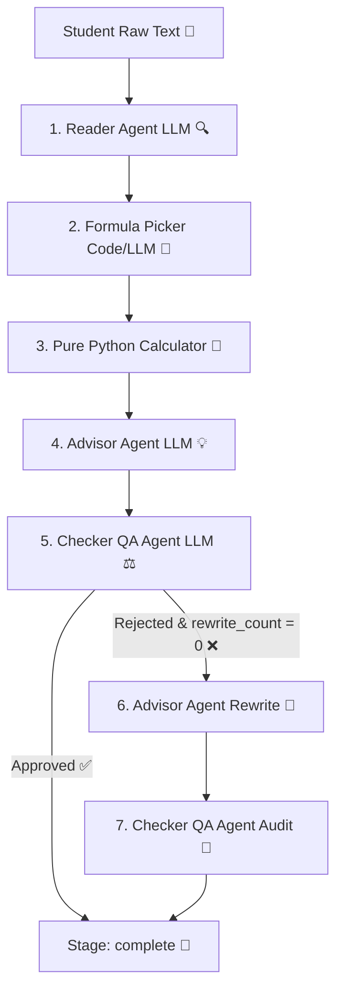

# 🎓 Admission Advisor Multi-Agent System 🚀

An advanced, reliable multi-agent admissions counseling pipeline engineered to parse student marks, dynamically match university admission criteria, compute merit percentages via a deterministic calculator, and generate quality-audited counseling advice.

---

## 🏗️ System Architecture & Workflow

The pipeline separates structural concerns to prevent math hallucinations, logical drift, and token waste. Below is the workflow diagram:



---

## 📂 File-by-File Responsibility Directory

Explore each component of this multi-agent system:

### 🤖 Core Agents (`agents/`)
* **[reader.py](file:///c:/Users/usmanbari/Desktop/agentic-ai-project/agents/reader.py)**: Extracts obtained scores, totals, and target university strings. Powered by [reader_v1.md](file:///c:/Users/usmanbari/Desktop/agentic-ai-project/prompts/reader_v1.md).
* **[formula_picker.py](file:///c:/Users/usmanbari/Desktop/agentic-ai-project/agents/formula_picker.py)**: Matches target university names with official keys/aliases using exact code checks, falling back to [formula_picker_fallback_v1.md](file:///c:/Users/usmanbari/Desktop/agentic-ai-project/prompts/formula_picker_fallback_v1.md) for fuzzy matches.
* **[advisor.py](file:///c:/Users/usmanbari/Desktop/agentic-ai-project/agents/advisor.py)**: Generates human-like, realistic counseling advice via [advisor_v1.md](file:///c:/Users/usmanbari/Desktop/agentic-ai-project/prompts/advisor_v1.md). Handles corrections on checker rejection.
* **[checker.py](file:///c:/Users/usmanbari/Desktop/agentic-ai-project/agents/checker.py)**: Audits Advisor output against merit score metrics and eligibility. Powered by [checker_v1.md](file:///c:/Users/usmanbari/Desktop/agentic-ai-project/prompts/checker_v1.md).
* **[grader.py](file:///c:/Users/usmanbari/Desktop/agentic-ai-project/agents/grader.py)**: Evaluating advisor output helpfulness and realism, generating JSON metrics.

### 🧮 Pure Code Calculations & Analytics (`tools/`)
* **[calculator.py](file:///c:/Users/usmanbari/Desktop/agentic-ai-project/tools/calculator.py)**: A deterministic Python calculator with **zero LLM imports** that normalizes academic marks to percentages and computes weighted merits.
* **[generate_dashboard_data.py](file:///c:/Users/usmanbari/Desktop/agentic-ai-project/tools/generate_dashboard_data.py)**: Gathers telemetry logs from the `runs/` directory to output dashboard structures.

### 🧪 Automated Verification Suite (`tests/`)
* **[test_pipeline_accuracy.py](file:///c:/Users/usmanbari/Desktop/agentic-ai-project/tests/test_pipeline_accuracy.py)**: Validates pipeline outputs against 12 hand-worked student profiles in `data/test_students.json`.
* **[test_llm_stability.py](file:///c:/Users/usmanbari/Desktop/agentic-ai-project/tests/test_llm_stability.py)**: Loops the test suite recursively over multiple iterations to ensure consistent outputs.
* **[test_adversarial_robustness.py](file:///c:/Users/usmanbari/Desktop/agentic-ai-project/tests/test_adversarial_robustness.py)**: Challenges the pipeline with typos, conflicting details, and alphanumeric numbers.
* **[test_reader_stress.py](file:///c:/Users/usmanbari/Desktop/agentic-ai-project/tests/test_reader_stress.py)**: Stresses the Reader with nonsense text, contextless numbers, and self-contradictory marks.
* **[test_calculator_stress.py](file:///c:/Users/usmanbari/Desktop/agentic-ai-project/tests/test_calculator_stress.py)**: Evaluates calculator mathematics (exact boundaries, division-by-zero, negative marks, non-1.0 weight splits).
* **[test_formula_picker_stress.py](file:///c:/Users/usmanbari/Desktop/agentic-ai-project/tests/test_formula_picker_stress.py)**: Tests formulapicker boundaries under ambiguous substrings or fictional universities.
* **[test_checker_stress.py](file:///c:/Users/usmanbari/Desktop/agentic-ai-project/tests/test_checker_stress.py)**: Stresses checker validation strictness under salesy tones or program mismatches.

### ⚙️ Orchestration & State
* **[pipeline.py](file:///c:/Users/usmanbari/Desktop/agentic-ai-project/pipeline.py)**: Core runner that joins the stages, measures durations in milliseconds, caches results, and runs the rewrite loop.
* **[state.py](file:///c:/Users/usmanbari/Desktop/agentic-ai-project/state.py)**: Initializes the schema dictionary representing runtime state.
* **[config.py](file:///c:/Users/usmanbari/Desktop/agentic-ai-project/config.py)**: Controls LLM temperature, retry constants, and rewrite limits.

---

## ⚡ Setup & Installation

### 1. Install Dependencies 📦
Install the required packages:
```bash
pip install -r requirements.txt
```

### 2. Configure Environment variables 🔑
Copy `.env.example` to `.env` and fill in your Groq API credentials:
```bash
# Windows command
copy .env.example .env
```
Open `.env` and set:
```env
GROQ_API_KEY=your_groq_api_key_here
MODEL_NAME=llama-3.1-8b-instant
TEMPERATURE=0.0
MAX_RETRIES=3
```

---

## 🕹️ CLI & Interactive Demos

### Run counselor batch test cases:
```bash
python main.py
```

### Start the step-by-step Interactive Counselor CLI:
```bash
python demo.py
```
*Choose custom text inquiries, fuzzy typo matchers, missing marks grace cases, or deliberate checker rejection loops.*

### Bypass Memory Caching ⚡
Add `--no-cache` to main or demo scripts to enforce fresh LLM runs and skip lookups in [memory_cache.json](file:///c:/Users/usmanbari/Desktop/agentic-ai-project/data/memory_cache.json):
```bash
python main.py --no-cache
python demo.py --no-cache
```

---

## 📊 Visual Performance Dashboard

Compile all run logs and load the visual web dashboard:
```bash
# 1. Compile runs/ history statistics into visual metrics
python tools/generate_dashboard_data.py

# 2. Open dashboard.html in your web browser
```
*Displays KPI metrics, cache hit rate charts, stage failure distributions, and test coverage indicators.*

---

## 🧪 Testing Commands Directory

Validate system performance, stability, and robustness:

| Target | Test Script | Description |
|---|---|---|
| **Pipeline Accuracy** | `python tests/test_pipeline_accuracy.py` | Tests accuracy across 12 hand-worked student profiles |
| **LLM Stability** | `python tests/test_llm_stability.py` | Runs pipeline multiple times to ensure output consistency |
| **Robustness** | `python tests/test_adversarial_robustness.py` | Challenges parsing with typos and conflicting inputs |
| **Reader Stress** | `python tests/test_reader_stress.py` | Tests reader under garbled, Urdu-English, and contradictory input |
| **Calculator Stress** | `python tests/test_calculator_stress.py` | Tests mathematical limits, division-by-zero, and weight sums |
| **Picker Stress** | `python tests/test_formula_picker_stress.py` | Tests picker matching under ambiguous substrings and fictional names |
| **Checker Stress** | `python tests/test_checker_stress.py` | Tests checker consistency under salesy tone and program mismatches |
