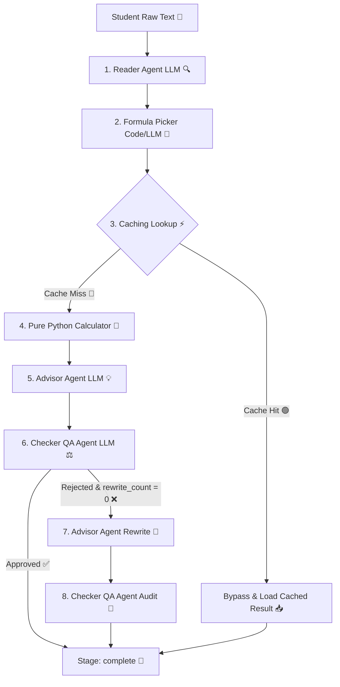

# 🎓 Admission Advisor Multi-Agent System 🚀

An advanced, reliable multi-agent admissions counseling pipeline engineered to parse student marks, dynamically match university admission criteria, compute merit percentages via a deterministic calculator, and generate quality-audited counseling advice.

---

## 🏗️ System Architecture & Workflow

The pipeline separates structural concerns to prevent math hallucinations, logical drift, and token waste. Below is the workflow diagram:



---

## 🎯 Project Acceptance Criteria

The system is evaluated against the following strict supervisor-defined guidelines:

### 1. Objective Technical Criteria
* **Stage Progression**: Pipeline stops at the exact expected lifecycle stage (e.g. `complete`, `failed_at_formula_picker`, `failed_at_calculator`).
* **University Resolution**: Matches raw inputs to correct canonical names in `formulas.json`.
* **Formula Display**: Output formula must match config displays exactly.
* **Math Precision**: Final merit score must be correct within a **±0.01%** floating-point tolerance.
* **Eligibility Cutoff**: Eligibility evaluated strictly against the **50%** aggregate cutoff.

### 2. Subjective Quality Criteria
* **Helpfulness**: Recommendations must align with student merit levels and provide constructive paths forward.
* **Realism & Tone**: Encouraging and honest counseling style; avoiding false guarantees of admission.
* **Language Styling**: Never leaks internal programmatic states (`true`/`false` booleans or raw JSON variable names).

---

## 📂 File-by-File Responsibility Directory

Below is the directory map detailing the role and responsibility of each file within this codebase:

### ⚙️ Core Orchestrator & State Configuration
* **[pipeline.py](file:///c:/Users/usmanbari/Desktop/agentic-ai-project/pipeline.py)**: The central runner that chains all agent stages, manages caching lookups, measures execution durations, and coordinates the checker rewrite loop.
* **[state.py](file:///c:/Users/usmanbari/Desktop/agentic-ai-project/state.py)**: Defines the dictionary schema representing the system execution state passed between stages.
* **[config.py](file:///c:/Users/usmanbari/Desktop/agentic-ai-project/config.py)**: Controls key configurations such as LLM temperatures, retry rates, and rewrite limits.
* **[main.py](file:///c:/Users/usmanbari/Desktop/agentic-ai-project/main.py)**: The main batch driver script that runs the evaluation suite over all test student profiles.
* **[demo.py](file:///c:/Users/usmanbari/Desktop/agentic-ai-project/demo.py)**: The interactive demonstration script offering a CLI menu to showcase specific execution paths.
* **[requirements.txt](file:///c:/Users/usmanbari/Desktop/agentic-ai-project/requirements.txt)**: List of Python package dependencies.
* **[.gitignore](file:///c:/Users/usmanbari/Desktop/agentic-ai-project/.gitignore)**: Rules for ignoring temporary files and environment credentials in Git.
* **[.env.example](file:///c:/Users/usmanbari/Desktop/agentic-ai-project/.env.example)**: Prototype template for specifying model details and Groq API keys.

### 🤖 Core Agents (`agents/`)
* **[reader.py](file:///c:/Users/usmanbari/Desktop/agentic-ai-project/agents/reader.py)**: Reader agent (LLM) extracting obtained scores, totals, and target university strings. Powered by [reader_v1.md](file:///c:/Users/usmanbari/Desktop/agentic-ai-project/prompts/reader_v1.md).
* **[formula_picker.py](file:///c:/Users/usmanbari/Desktop/agentic-ai-project/agents/formula_picker.py)**: Resolves university name queries against formulas.json keys, falling back to [formula_picker_fallback_v1.md](file:///c:/Users/usmanbari/Desktop/agentic-ai-project/prompts/formula_picker_fallback_v1.md) for fuzzy matches.
* **[advisor.py](file:///c:/Users/usmanbari/Desktop/agentic-ai-project/agents/advisor.py)**: Generates encouraging counseling advice via [advisor_v1.md](file:///c:/Users/usmanbari/Desktop/agentic-ai-project/prompts/advisor_v1.md). Handles corrections on QA rejection.
* **[checker.py](file:///c:/Users/usmanbari/Desktop/agentic-ai-project/agents/checker.py)**: Audits Advisor output against merit score metrics and eligibility. Powered by [checker_v1.md](file:///c:/Users/usmanbari/Desktop/agentic-ai-project/prompts/checker_v1.md).
* **[grader.py](file:///c:/Users/usmanbari/Desktop/agentic-ai-project/agents/grader.py)**: Meta-evaluation agent grading final advice realism and helpfulness on a 1-10 scale.
* **[single_agent.py](file:///c:/Users/usmanbari/Desktop/agentic-ai-project/agents/single_agent.py)**: Milestone 1 baseline single-agent implementation (used for failure comparison).

### 🧮 Pure Code Calculations & Analytics (`tools/`)
* **[calculator.py](file:///c:/Users/usmanbari/Desktop/agentic-ai-project/tools/calculator.py)**: A deterministic Python calculator with **zero LLM imports** that normalizes academic marks to percentages and computes weighted merits.
* **[generate_dashboard_data.py](file:///c:/Users/usmanbari/Desktop/agentic-ai-project/tools/generate_dashboard_data.py)**: Gathers telemetry logs from the `runs/` directory to output dashboard structures.

### 🧪 Automated Verification Suite (`tests/`)
* **[test_pipeline_accuracy.py](file:///c:/Users/usmanbari/Desktop/agentic-ai-project/tests/test_pipeline_accuracy.py)**: Validates pipeline outputs against 12 hand-worked student profiles in `data/test_students.json`.
* **[test_llm_stability.py](file:///c:/Users/usmanbari/Desktop/agentic-ai-project/tests/test_llm_stability.py)**: Loops the test suite recursively over multiple iterations to ensure consistent outputs.
* **[test_adversarial_robustness.py](file:///c:/Users/usmanbari/Desktop/agentic-ai-project/tests/test_adversarial_robustness.py)**: Challenges the pipeline with typos, conflicting details, and alphanumeric numbers.
* **[test_reader_stress.py](file:///c:/Users/usmanbari/Desktop/agentic-ai-project/tests/test_reader_stress.py)**: Stresses the Reader with nonsense text, contextless numbers, and self-contradictory marks.
* **[test_calculator_stress.py](file:///c:/Users/usmanbari/Desktop/agentic-ai-project/tests/test_calculator_stress.py)**: Evaluates calculator mathematics (exact boundaries, division-by-zero, negative marks, non-1.0 weight splits).
* **[test_formula_picker_stress.py](file:///c:/Users/usmanbari/Desktop/agentic-ai-project/tests/test_formula_picker_stress.py)**: Tests formula picker boundaries under ambiguous substrings or fictional universities.
* **[test_checker_stress.py](file:///c:/Users/usmanbari/Desktop/agentic-ai-project/tests/test_checker_stress.py)**: Stresses checker validation strictness under salesy tones or program mismatches.

### 📁 Reference Data & Cache (`data/`)
* **[formulas.json](file:///c:/Users/usmanbari/Desktop/agentic-ai-project/data/formulas.json)**: Core database representing official weights, aliases, and standard fallback totals for universities.
* **[test_students.json](file:///c:/Users/usmanbari/Desktop/agentic-ai-project/data/test_students.json)**: The dataset containing the 12 evaluation student test profiles.
* **[memory_cache.json](file:///c:/Users/usmanbari/Desktop/agentic-ai-project/data/memory_cache.json)**: Cache storage for mapping hashed structured student marks to pre-calculated results.

### 📝 Project Reports & Analysis Documents (`reports/`)
* **[day1_failure_notes.md](file:///c:/Users/usmanbari/Desktop/agentic-ai-project/reports/day1_failure_notes.md)**: Logs documenting the mathematical and formula hallucinations of the single-agent baseline.
* **[before_after_report.md](file:///c:/Users/usmanbari/Desktop/agentic-ai-project/reports/before_after_report.md)**: Detailed report on the resolution of the robotic phrasing issue.
* **[design_writeup.md](file:///c:/Users/usmanbari/Desktop/agentic-ai-project/reports/design_writeup.md)**: Architectural documentation detailing component design decisions.
* **[stress_test_findings.md](file:///c:/Users/usmanbari/Desktop/agentic-ai-project/reports/stress_test_findings.md)**: Classification of component breaking points under adversarial stress testing.
* **[grader_trust_analysis.md](file:///c:/Users/usmanbari/Desktop/agentic-ai-project/reports/grader_trust_analysis.md)**: Analysis of AI Grader v2 vs Human Grades and confound isolation evaluations.
* **[cross_exam_answer.md](file:///c:/Users/usmanbari/Desktop/agentic-ai-project/reports/cross_exam_answer.md)**: Response details to mentoring panel review questions.
* **[test_results_day7.md](file:///c:/Users/usmanbari/Desktop/agentic-ai-project/reports/test_results_day7.md)**: Final verification logs confirming 100.0% pipeline accuracy.

---

## 📊 Where are the Results?

The system generates results and telemetry records in several directories:

1. **Pipeline Execution Logs (`runs/`)**: 
   Every run of the multi-agent pipeline is saved as a detailed report JSON in the `runs/` directory (e.g., `runs/run_001.json`). This log records the raw input, timestamp, matched university, computed scores, advice drafts, and stage performance durations.
2. **Grader and Evaluation Grades (`reports/`)**:
   * **[grader_scores.json](file:///c:/Users/usmanbari/Desktop/agentic-ai-project/reports/grader_scores.json)**: Contains the evaluations (realism and helpfulness scores) generated by the Meta-Grader.
   * **[human_grades.json](file:///c:/Users/usmanbari/Desktop/agentic-ai-project/reports/human_grades.json)**: Contains the reference evaluations compiled by human reviewers.
3. **Stress Testing Raw Outputs (`reports/`)**:
   * Isolated component stress raw dumps are captured in `reports/*_stress_raw.json` files.
4. **Accuracy Test Reports (`reports/`)**:
   * **[test_results_day7.md](file:///c:/Users/usmanbari/Desktop/agentic-ai-project/reports/test_results_day7.md)**: Holds the final PASS/FAIL test grid verifying the system's 100.0% accuracy.
5. **Interactive Telemetry Dashboard (`dashboard.html`)**:
   Visualize the aggregate metrics by executing:
   ```bash
   python tools/generate_dashboard_data.py
   ```
   Then, open **[dashboard.html](file:///c:/Users/usmanbari/Desktop/agentic-ai-project/dashboard.html)** in a web browser to view cache hit rates, error counts, latency histograms, and test summaries.

---

## ⚡ Setup & Installation

### 1. Install Dependencies 📦
Install the required packages:
```bash
pip install -r requirements.txt
```

### 2. Configure Environment variables 🔑
Copy `.env.example` to `.env` and fill in your Groq API credentials:
```bash
# Windows command
copy .env.example .env
```
Open `.env` and set:
```env
GROQ_API_KEY=your_groq_api_key_here
MODEL_NAME=llama-3.1-8b-instant
TEMPERATURE=0.0
MAX_RETRIES=3
```

---

## 🕹️ CLI & Interactive Demos (`demo.py`)

### When to run `demo.py`?
You should run `demo.py` to:
* **Demonstrate the multi-agent system interactively** to users, stakeholders, or examiners.
* **Inspect step-by-step execution details** of individual stages (Reader, Picker, Calculator, Advisor, Checker).
* **Verify edge-case paths** such as typo matches, missing exam criteria, unregistered university handling, and the checker rewrite loop.
* **Observe caching behavior** (testing cached vs. fresh run performance speedups).

### How to run it?
Run the interactive script from your command line:
```bash
python demo.py
```
This loads an interactive terminal console with 6 options:
1. **Enter custom student profile**: Type any natural language student query (e.g. *"I scored 900 in Matric and 880 in FSC. What are my chances at UET Lahore?"*) to observe the execution.
2. **Run Demo: Fuzzy matching**: Automatically runs a profile with university typos (e.g. `"KIng EdWard U."`) to verify the picker fallback logic.
3. **Run Demo: Missing marks**: Simulates a student applying without an entry exam score to verify graceful calculation halts.
4. **Run Demo: Unmatched university**: Challenges the picker with an unregistered university (e.g. `"Greenwood Institute"`) to demonstrate error catching.
5. **Run Demo: Checker audit rejection & rewrite loop**: Triggers the rewrite mechanism by feeding an overly optimistic first draft to the Checker, prompting a rejection and successful revision.
6. **Exit**: Gracefully closes the demo.

### Command-Line Options
You can pass flags to modify the demo execution:

* **Bypass the Cache (`--no-cache`)**:
  Enforces fresh LLM calls for every stage, ignoring the caching layer.
  ```bash
  python demo.py --no-cache
  ```
* **Direct Rejection Demo Run (`--demo-broken`)**:
  Immediately executes the checker audit rejection and rewrite loop demo without showing the interactive selection menu.
  ```bash
  python demo.py --demo-broken
  ```

---

## 🧪 Testing Commands Directory

Validate system performance, stability, and robustness:

| Target | Test Command | Description |
|---|---|---|
| **Pipeline Accuracy** | `python tests/test_pipeline_accuracy.py` | Tests accuracy across 12 hand-worked student profiles |
| **LLM Stability** | `python tests/test_llm_stability.py` | Runs pipeline multiple times to ensure output consistency |
| **Robustness** | `python tests/test_adversarial_robustness.py` | Challenges parsing with typos and conflicting inputs |
| **Reader Stress** | `python tests/test_reader_stress.py` | Tests reader under garbled, Urdu-English, and contradictory input |
| **Calculator Stress** | `python tests/test_calculator_stress.py` | Tests mathematical limits, division-by-zero, and weight sums |
| **Picker Stress** | `python tests/test_formula_picker_stress.py` | Tests picker matching under ambiguous substrings and fictional names |
| **Checker Stress** | `python tests/test_checker_stress.py` | Tests checker consistency under salesy tone and program mismatches |
